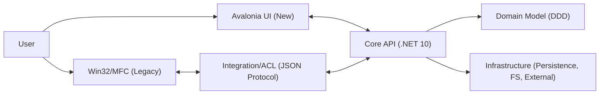
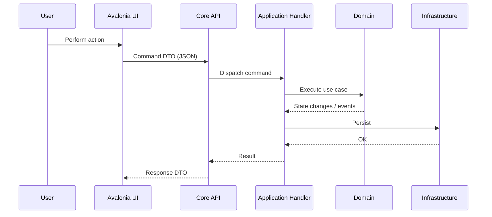
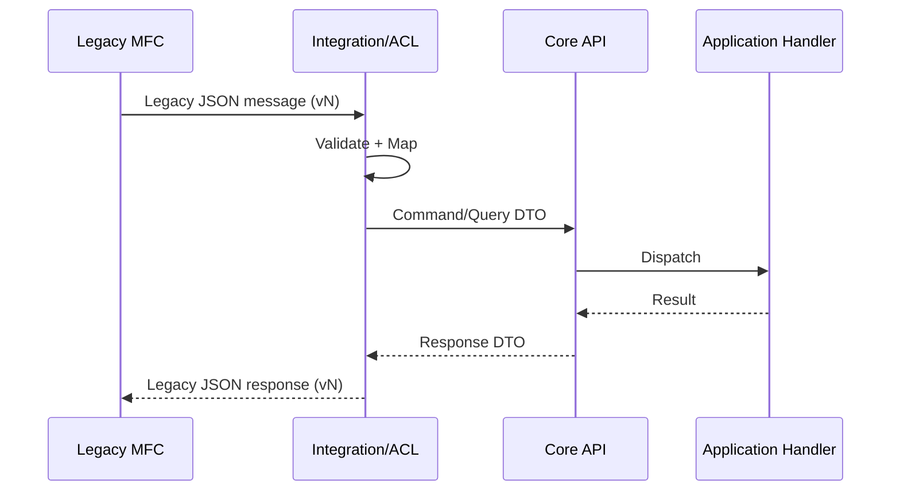

# Architecture

This document describes the intended architecture for a Windows desktop
application composed of:
- A legacy **Win32/MFC** component
- A **.NET 10** application built using **DDD** principles and exposing an **API**
- A new **Avalonia** UI that interacts with the API
- An integration path between old and new components using a **JSON protocol**
- All components running on **one Windows machine**, typically under a
  **standard user** account (with other local users potentially having admin
  rights)

## Goals
- Allow incremental modernization (legacy + new can coexist).
- Keep domain/business logic centralized in the .NET application layer.
- Make UI layers (Avalonia, MFC) thin and replaceable.
- Provide a stable integration surface via versioned contracts (JSON protocol
  + API).

## Non-Goals
- Designing a distributed/multi-machine deployment (this is a single-machine system).
- Building a plugin ecosystem (unless explicitly added later).

## System Context

- Primary actor: the interactive end user on the Windows machine (standard user context).
- External systems: optional (e.g., file system, network services), not assumed by default.

## High-Level Component Model

### Components
- **Avalonia UI (New UI)**
  - Presents screens, collects user input.
  - Calls the .NET API for queries and commands.
  - Does not contain domain rules beyond basic presentation validation.

- **Legacy Win32/MFC (Old UI / Legacy Component)**
  - Provides existing functionality that has not yet been migrated.
  - Interacts with the .NET system through a JSON-based integration (directly or via an adapter).

- **.NET 10 Core (DDD Application + API)**
  - System of record for domain state and business rules.
  - Exposes an API for:
    - Commands (state-changing operations)
    - Queries (read models)
  - Contains an integration layer that understands the JSON protocol used by old/new components.

### Recommended Layering Inside the .NET Core (DDD)
- **Presentation/API Layer**
  - HTTP/IPC endpoints, request/response DTOs, authentication context.
  - No direct database logic; minimal orchestration.

- **Application Layer**
  - Use cases (command/query handlers), transactions, orchestration.
  - Authorization checks for business actions.

- **Domain Layer**
  - Aggregates, entities, value objects, domain services, domain events.
  - Invariants enforced here.

- **Infrastructure Layer**
  - Persistence, file system access, external service clients.
  - Implementations of interfaces defined by Application/Domain.

- **Integration (Anti-Corruption Layer)**
  - Translation between legacy JSON protocol and internal application commands/queries.
  - Versioned contract mapping and compatibility behavior.

## Process & Deployment Model (Single Machine)

This design supports multiple hosting models depending on operational constraints. Pick one and standardize it.

### Option A (Common): Separate Processes + Local IPC
- `avalonia-ui.exe` (standard user)
- `core-api.exe` (standard user; local-only)
- `legacy-mfc.exe` (standard user)

IPC choices (prefer one):
- Loopback HTTP (`127.0.0.1:<port>`) for API calls
- Windows Named Pipes (local-only, enforceable ACLs)

### Option B: Core In-Process (Not Recommended for Long Term)
- UI hosts core assemblies directly.
- Faster to prototype, but weakens isolation and makes legacy integration harder to reason about.

## Interfaces & Contracts

### API Contract (Avalonia <-> Core)
- Style: request/response; commands and queries.
- Transport: local-only (loopback HTTP or named pipe).
- DTOs: stable versioned DTOs; avoid leaking domain entities directly.

### JSON Protocol Contract (Legacy <-> New)
- Versioned message schema with explicit message types.
- Strict validation at boundaries.
- Mapping done in the integration/ACL layer to prevent domain contamination by legacy shapes.

## Data Ownership & Persistence
- Domain state is owned by the .NET core.
- UI layers do not write directly to the database (or other durable storage).
- If the legacy component has its own storage today:
  - Plan a migration strategy (read-through adapter, dual-write with reconciliation, or one-time migration).

Storage location (recommended baseline):
- Per-user data in `%LOCALAPPDATA%\\<Vendor>\\<Product>` (or similar)
- Logs in a sibling folder with restricted ACLs

## Typical Flows

### 1) User Action in Avalonia (Command Flow)
1. User clicks/inputs in Avalonia UI.
2. UI sends a command request to the Core API.
3. Core API authenticates caller context (local session) and validates request DTO.
4. Application handler executes use case, calls domain model.
5. Domain enforces invariants and produces state changes (and possibly domain events).
6. Infrastructure persists changes.
7. Core returns result to UI (success/failure + relevant view model data).

### 2) Data Display in Avalonia (Query Flow)
1. UI requests data via query endpoint.
2. Core resolves query (read model).
3. Core returns DTO to UI for rendering.

### 3) Legacy Functionality Delegating to Core (Integration Flow)
1. Legacy MFC component emits JSON request/event.
2. Integration/ACL validates schema and version.
3. Integration maps legacy message to application command/query.
4. Core processes request and returns a mapped legacy-compatible response.

## Diagrams

### Component Diagram

### Sequence: Avalonia Command

### Sequence: Legacy JSON Protocol

## Error Handling & Resilience
- Use structured error responses (problem-details style or equivalent).
- For legacy JSON: map errors to stable error codes; avoid leaking internal stack traces.
- Apply timeouts, cancellation, and concurrency limits at the API boundary.

## Observability
- Structured logs with correlation IDs across UI/API/legacy boundaries.
- Log domain-relevant events (without secrets/PII).
- Local diagnostics bundle (optional) for support: configs + logs + version info.

## Versioning & Compatibility
- API: semantic versioning for DTOs and endpoints; additive changes preferred.
- Legacy protocol: explicit `protocolVersion` and message type IDs.
- Deprecation plan: document supported versions and end-of-life windows.

## Security Notes
- Treat all boundary inputs as untrusted: API requests and JSON protocol messages.
- Prefer local-only transports; do not accidentally bind APIs to all interfaces.
- Store secrets using Windows DPAPI (CurrentUser) when needed.

See `docs/attac-vectors.md` for a fuller threat/mitigation list.

## Open Decisions (Fill In)
- IPC choice for UI <-> API: loopback HTTP vs named pipes.

- Is the Core API always-on (service) or started on-demand by the UI?
- Persistence: database type (SQLite/local files/etc.), schema ownership, migration strategy.
- Legacy integration: separate process vs in-proc module; request/response vs event-driven.
